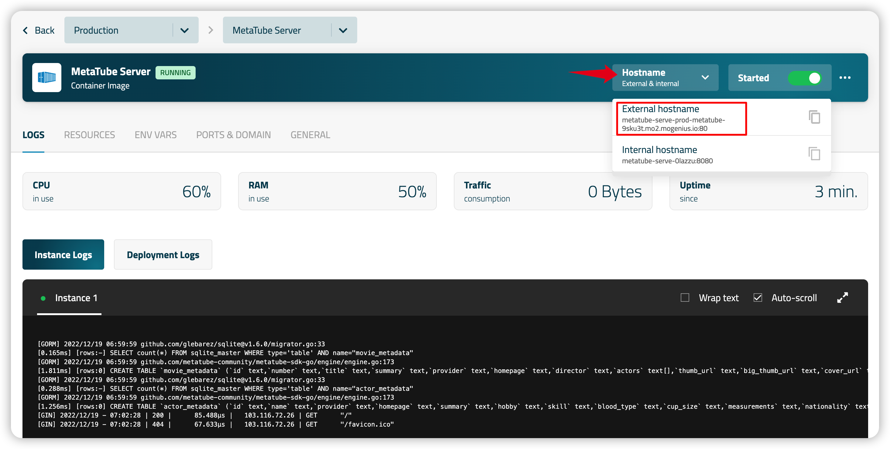
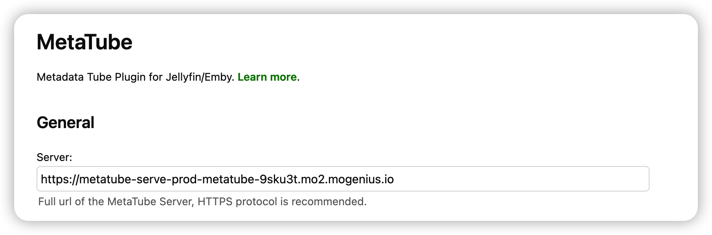

# Mogenius 快速部署

## ‼️置顶

Mogenius 不再提供免费额度。

~~参考本教程快速将`MetaTube`后端**免费**部署至[`Mogenius`](https://mogenius.com/)云平台。~~

## 具体步骤

> 以下步骤需要有Mogenius账号，没有账号的需要先[注册](https://studio.mogenius.com/user/registration)。

### 部署服务

- 进入仪表盘，点击`Create cloudspace`

- 如图输入项目名称，默认使用Free计划，然后点击`Create now`

- 创建完成后，点击`Container Images`的加号`➕`添加镜像

- 分别输入服务名称，然后输入镜像地址：`metatube/metatube-server:latest`

- 在下面的资源配置里调整成如图所示，也可以按情况增加

- 输入8080，然后点击`Create Service`

- 如图所示即创建完成，点击`Hostname`并复制第一个`External hostname`

- 将`hostname`粘贴到插件配置页面。

**注意**：如下图所示，这里需要将原来复制的hostname最后的`:80`端口号删掉，并在最前面加上`https://`

