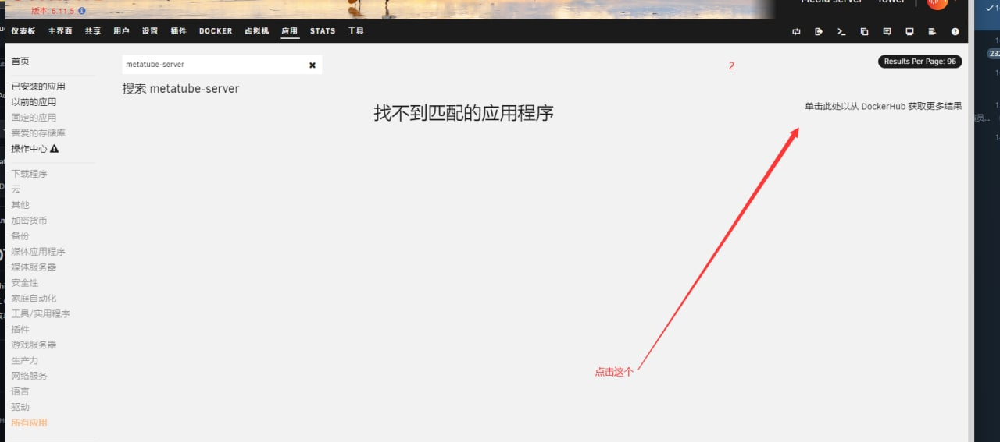

# Unraid 快速部署

> Unraid is a proprietary Linux-based operating system designed to run on home media server setups that operates as a network-attached storage device, application server, and virtualization host.

**注意**: 以下教程使用 Unraid 部署服务端，由于没有开启`HTTPS`，会导致在`Emby`下手动**识别**时无法加载预览图片的情况发生，但并不影响使用。

## 具体步骤

> 以下步骤来自某热心群友

### 部署后端

- 尝试搜索`metatube-server`

- 点击从`DockerHub`获取更多

- 确定配置，点击确认

- 默认使用内存模式，如果需要可以配置 DSN（如：metatube.db，需要同时映射文件路径）开启数据库模式

> 注意：这里不需要删除全部选项

- 配置端口号，可以任意

- 优先尝试使用 Bridge 模式

### 配置插件

- 复制一下服务端地址

- 粘贴至插件配置页面即可

